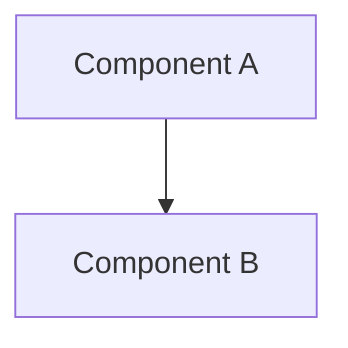
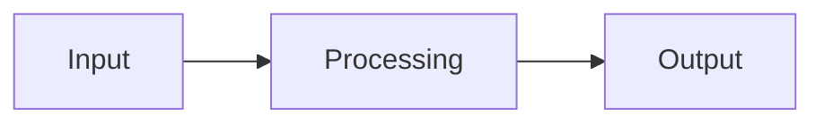

# {{TITLE}}

<!-- sdd-validate format contract:
- Store this document as UTF-8 with LF line endings and keep the YAML
  frontmatter as a mapping between standalone `---` delimiters.
- Keep `title`, `type`, `status`, `created`, `updated`, `tags`, and `related`;
  dates use `YYYY-MM-DD` and status is one of `draft`, `review`, `approved`,
  `implemented`, or `superseded`.
- Keep every H2 heading supplied by this template with exactly the shown text.
- Keep `tags` and `related` as YAML lists. Each `related` value must be a
  nonempty planning-root-relative artifact path that resolves; include the
  governing spec directly or through a resolvable design/plan relationship.
- Every FR-NN, NFR-NN, or AC-NN citation must resolve in a related spec. When an
  approved, active, or complete plan directly relates this design, the related
  designs collectively must cite every FR-NN and NFR-NN in that plan's related
  specs. Cite each requirement in the section that realizes it.
- Any D-NNNN citation must resolve in the applicable decision ledger; a live
  design must not cite a rejected or superseded decision.
-->

## Overview
Brief description of the component and its role in the system.

## Architecture

Use Mermaid diagrams to illustrate structure and flow — prefer over ASCII art or prose-only descriptions.

### Components
Describe the major components and their responsibilities.

### Data Flow
How data moves through the system.

### Interfaces
Public APIs, events, or contracts.

## Design Decisions

### Decision 1: [Title]
**Context:**
**Options Considered:**
1.
2.
**Decision:**
**Rationale:**

## Error Handling
How errors are detected, reported, and recovered from.

## Testing Strategy
How the design will be validated.

### Structural Verification
Language-specific checks beyond tests (see `shared/language-verification.md`).

## Migration / Rollout
How to transition from current state to the new design.

<!-- Optional while draft/review. Before `approved`/`implemented`, resolve each
question or add an `## Open Questions` section whose bullets use the exact form
`- <question> — **non-blocking** — <why the design holds regardless>`. -->
