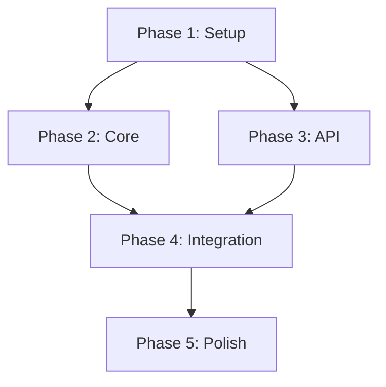

# Generate Mermaid Diagrams

## Path Resolution
Read `shared/agent-runtime.md` to locate bundled resources, then read `shared/path-resolution.md` to resolve artifact and target-repository paths.

## When to Use
When you need a visual representation of architecture, data flow, task dependencies, or system interactions. Produces Mermaid diagrams that render in GitHub, VS Code, and most markdown viewers.

## Process

1. **Determine Subject**
   - Ask what to diagram (or infer from context)
   - Read the relevant artifact(s) — plan, design, spec, or codebase
   - Identify the best diagram type for the subject

2. **Choose Diagram Type**

   | Subject | Recommended Type |
   |---------|-----------------|
   | Plan phase dependencies | `graph TD` (directed graph) |
   | Task breakdown | `graph TD` with subgraphs per phase |
   | Data flow | `flowchart LR` |
   | API interactions | `sequenceDiagram` |
   | System architecture | `graph TD` with subgraphs per component |
   | State transitions | `stateDiagram-v2` |
   | Timeline / Gantt | `gantt` |
   | Entity relationships | `erDiagram` |
   | Class structure | `classDiagram` |

3. **Generate Diagram**
   - Build the Mermaid source from the artifact data
   - Use clear, descriptive node labels
   - Group related nodes with `subgraph` where appropriate
   - Use consistent styling: status colors are reused across diagrams, applied with `class NODE className` statements (paired with the `classDef` block below)
     - Green (`class NODE complete`): complete / approved / implemented
     - Amber (`class NODE active`): in-progress / active / review
     - Gray (`class NODE planned`): planned / draft
     - Red (`class NODE blocked`): blocked
     - Dim gray (`class NODE muted`): deferred / archived / superseded

4. **Place Diagram**
   - **In an existing artifact**: Add a `## Diagram` section to the relevant document
   - **Standalone**: Create `Diagrams/<subject-slug>.md` from `shared/templates/diagram.md`. Set `status: active` (diagram statuses are `draft`/`active`/`archived` — a generated, complete diagram starts `active`), `tags` to the diagram type, and `related` to the source artifact path.

5. **Present to User**
   - Show the Mermaid source in a code block
   - Explain what the diagram represents
   - Ask if adjustments are needed (more/less detail, different type, different scope)

## Diagram Conventions

### Plan Dependency Diagram


### Style Definitions
Include at the bottom of each diagram:
```
classDef complete fill:#10b981,stroke:#059669,color:#fff
classDef active fill:#f59e0b,stroke:#d97706,color:#fff
classDef planned fill:#6b7280,stroke:#4b5563,color:#fff
classDef blocked fill:#ef4444,stroke:#dc2626,color:#fff
classDef muted fill:#374151,stroke:#1f2937,color:#9ca3af
```

## Output
Either modifies an existing artifact (adding a `## Diagram` section) or creates:
```
Diagrams/<subject-slug>.md
```

## Notes
- Keep diagrams focused — if it's too complex, split into multiple diagrams
- Prefer left-to-right (`LR`) for flows, top-down (`TD`) for hierarchies
- Use short node labels; add detail in surrounding markdown, not in the diagram
